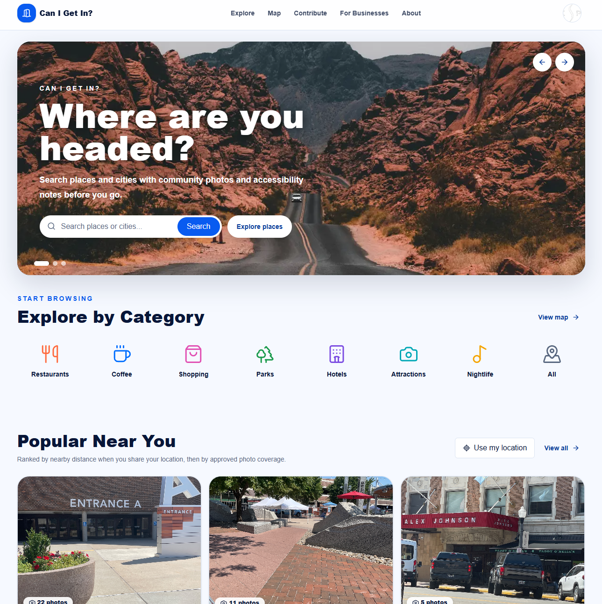
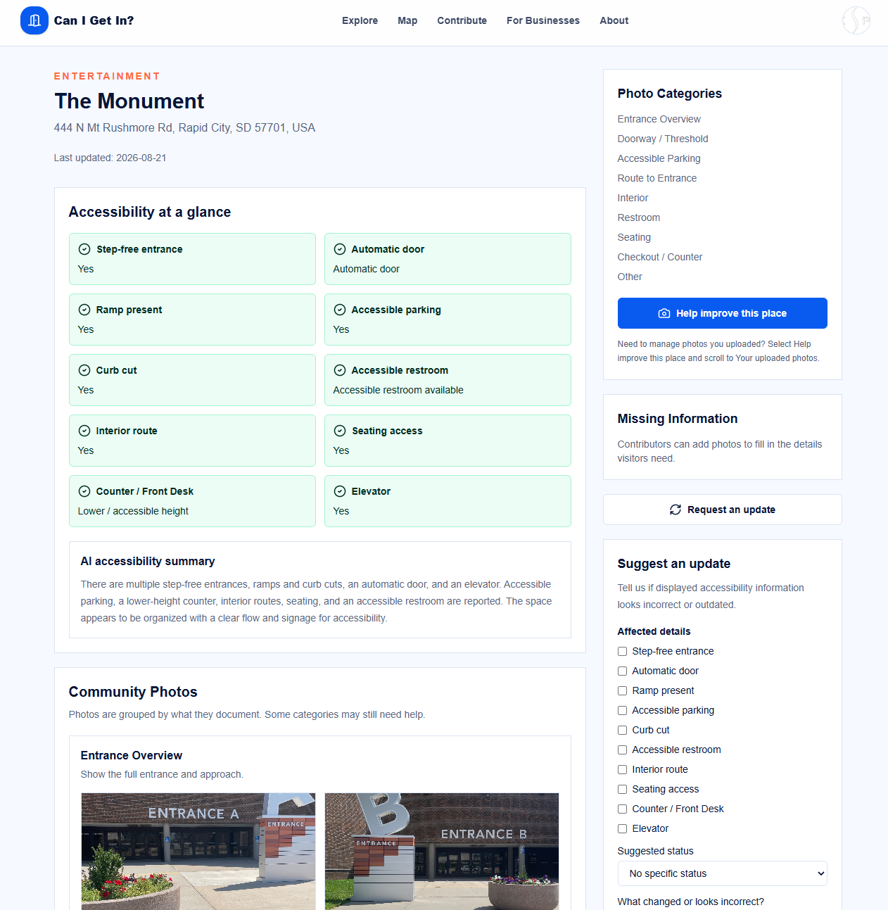
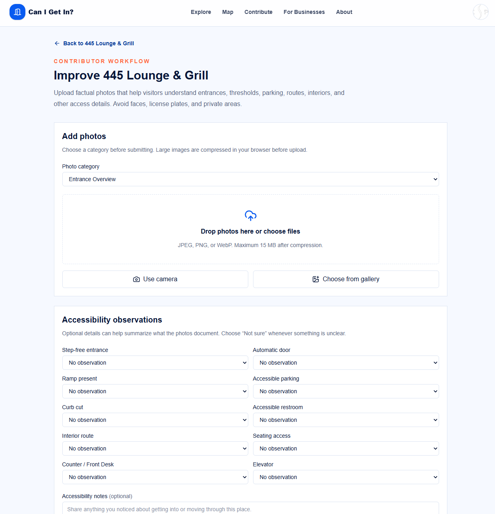
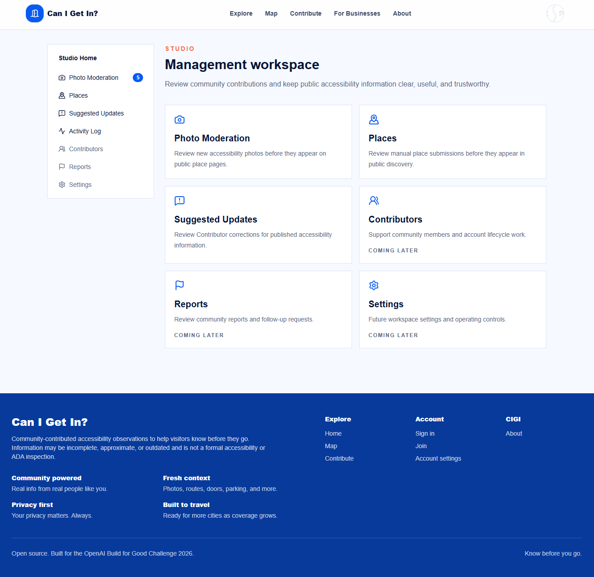
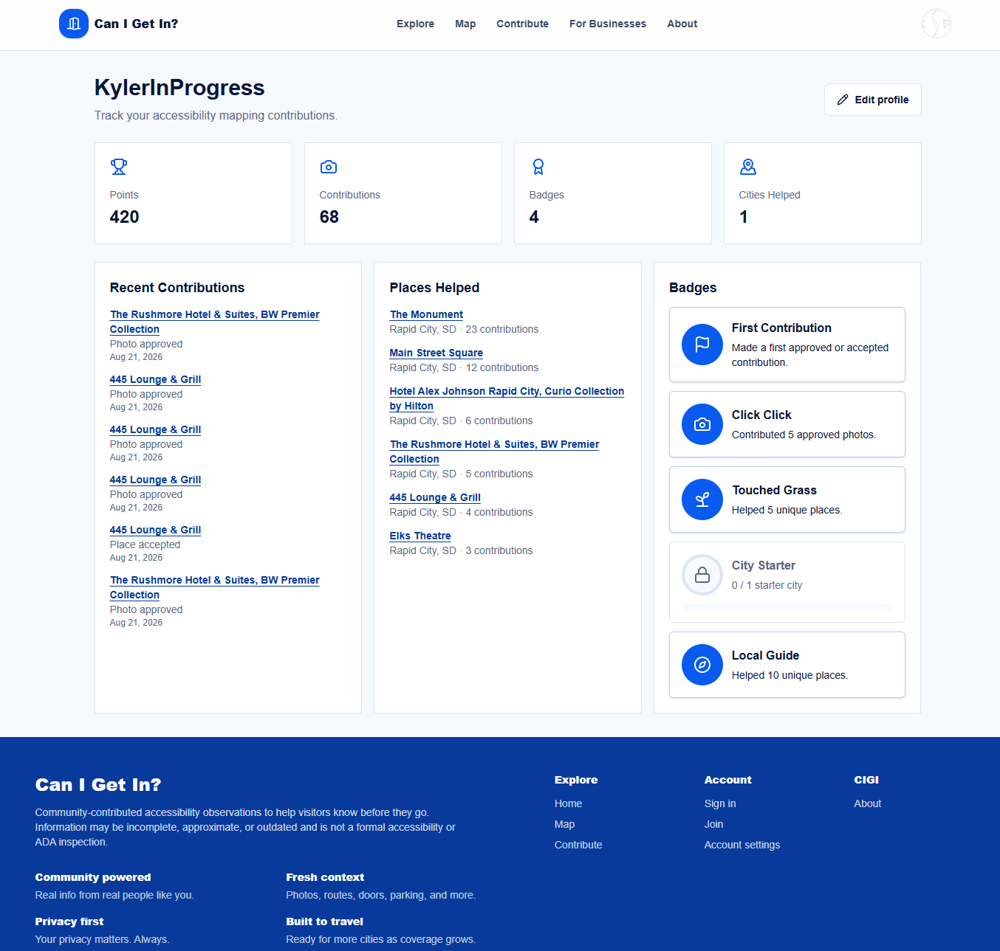

# Can I Get In?

**Know before you go.**

Built in less than three weeks for OpenAI's 2026 Build for Good Challenge.

Live demo: [https://canigetin.app](https://canigetin.app)

## What is Can I Get In?

Can I Get In? is a community-powered accessibility map that helps people understand what they'll encounter at a place before they arrive.



Contributors document real places with categorized photos and firsthand accessibility observations. CIGI combines that community knowledge with OpenAI-powered visual analysis to surface useful details about entrances, doors, parking, curb cuts, restrooms, counters, elevators, interior access, and more.

Rather than reducing accessibility to a single yes/no label, CIGI gives people the information they need to decide whether a place works for them.

CIGI is currently being piloted with real-world accessibility documentation in Rapid City, South Dakota.

## Why it exists

Accessibility information is often reduced to a checkbox: wheelchair accessible — yes or no.

Real life is more complicated.

A restaurant might have a step-free entrance but no automatic door. A hotel may have accessible parking but a standing-height front desk. A downtown business may technically be reachable by wheelchair while still requiring someone else to open the entrance.

Those details can determine whether someone can visit independently, needs assistance, or would rather choose somewhere else.

CIGI doesn't try to declare whether a place is universally “accessible.” It documents what is actually there.

Community photos let people see the environment for themselves. Structured observations capture details that photographs may miss. OpenAI helps interpret and organize that evidence without pretending to know what the evidence cannot establish.

The result is practical information someone can use before leaving home.

## Who it helps

CIGI is designed first for people whose ability to visit a place depends on its physical environment: wheelchair and mobility-device users, people with limited mobility, caregivers, families, and travelers planning unfamiliar outings.

It also gives communities a way to help.

A contributor doesn't need to perform an accessibility inspection. They can photograph an entrance, document the parking situation, note whether a door is automatic, or describe something they encountered. A few minutes of local knowledge can save someone else from arriving at a place they cannot comfortably use.

As contributions accumulate, CIGI can also reveal broader accessibility patterns across neighborhoods and cities.

## How it is being used

CIGI is currently being seeded as a pilot in Rapid City, South Dakota.

During the Build for Good challenge, real businesses, public spaces, hotels, restaurants, and other local destinations were added and documented through the same mobile contribution workflow available to any CIGI user.

A city does not need to be preloaded into CIGI. Contributors can search for a place, add it from verified place information, photograph it, and submit accessibility observations. Adding the first place in a new city effectively begins CIGI coverage there.

The goal is a map that grows organically from people documenting the communities they already know.

## How it works

**1. Find a place**  
Search CIGI or discover a place through Google Places.

**2. See what accessibility actually looks like**  
Review Accessibility at a Glance, community photography, and the AI-generated accessibility summary.



**3. Contribute what you know**  
Upload categorized photos and report structured details such as doors, ramps, curb cuts, parking, restrooms, counters, elevators, and interior access.



**4. AI + human moderation**  
OpenAI helps validate incoming photography and analyze accessibility evidence. Confidently valid photos can be approved automatically; uncertain submissions are routed to human moderators in Studio.

**5. Help the map grow**  
Contributions earn points and badges while expanding accessibility knowledge across places and cities.

Technical implementation, as of this repository state:

- Visitors can browse published places on the home page, `/map`, city/category discovery views, and `/places/[slug]`.
- Signed-in Contributors can complete a profile, add places, upload categorized accessibility photos, submit structured observations and notes, suggest updates, export account data, and request account deletion.
- Google Places powers verified place lookup and immediate published place creation. Manual place submissions are kept in a pending review flow.
- Approved photos and contributor observations become evidence for accessibility intelligence.
- Moderator/Admin users can access Studio routes for photo moderation, place review, suggested updates, and manual accessibility analysis.
- Public place pages show an "Accessibility at a glance" summary, community photo gallery, missing-information prompts, and update request form.

Can I Get In? provides community observations and planning information. It is not an official accessibility certification, ADA inspection, or guarantee that a location can be entered independently.

## OpenAI's role

OpenAI is used where automation can make community accessibility data more useful and scalable—not as an authority that decides whether a place is “accessible.”

CIGI uses OpenAI in two primary workflows:

**Accessibility intelligence.** Approved community photos are analyzed alongside structured contributor observations. The model produces structured accessibility findings and a natural-language summary while explicitly preserving unknown when the available evidence cannot support a conclusion.

**Photo moderation.** Newly submitted photographs are evaluated for place relevance and category fit. High-confidence valid submissions can move directly into CIGI; ambiguous results remain pending for human review rather than being automatically rejected.



This creates a deliberate human/AI relationship: **AI handles scalable interpretation and obvious cases; people remain responsible for ambiguous ones.**

Current technical integration:

- `src/lib/openai-photo-moderation.ts` calls the OpenAI Responses API to evaluate newly uploaded place photos.
- `src/app/api/photos/moderate/route.ts` prepares a signed Supabase Storage URL, asks OpenAI for a structured moderation result, and auto-approves only high-confidence, category-matching, place-relevant photos. Ambiguous results stay pending for Studio review.
- `src/lib/openai-accessibility.ts` calls the OpenAI Responses API to analyze approved photos plus Contributor observations for a place.
- `src/app/api/ai/analyze-place/route.ts` lets Studio users manually run place accessibility analysis.
- `src/app/api/contributions/observations/route.ts` and the photo moderation route schedule accessibility re-analysis after new evidence is saved or auto-approved.
- OpenAI outputs are constrained with JSON schema, normalized with Zod, stored in `place_ai_analyses` and `place_accessibility_observations`, and presented conservatively. The prompts explicitly avoid ADA/legal compliance claims and use `unknown` when evidence is missing or ambiguous.

## Built with Codex

Can I Get In? went from an idea to a deployed, real-world pilot in less than three weeks for OpenAI's Build for Good Challenge.

Codex served as the primary engineering partner throughout that process.

Development followed a tight loop:

product decision → Codex implementation → automated verification → production deployment → real desktop/mobile QA → iteration

Codex worked directly in the repository to build features, inspect existing architecture, create Supabase migrations, integrate APIs, write and update tests, debug production failures, and make targeted fixes based on hands-on testing.

That workflow mattered because many of CIGI's most important improvements came from using the product rather than designing it entirely in advance. Search was redesigned after mobile testing. Accessibility fields evolved after documenting real places. Moderation workflows changed when latency became confusing. AI behavior was evaluated against real-world photographs rather than only test fixtures.



At the end of the challenge, the project had grown into a deployed full-stack application backed by linting, strict type checking, production builds, and 162 automated tests.

Codex wasn't used simply to generate an initial codebase. It was part of an iterative engineering process from prototype through production QA.

## What's next

The Rapid City pilot is the starting point.

Next steps include expanding community coverage, improving accessibility analysis with real-world contribution data, creating contributor campaigns and mapping events, and exploring partnerships with local organizations, downtown associations, tourism groups, and businesses that want better visibility into accessibility.

Longer term, CIGI's value grows with its community: every documented entrance, restroom, curb cut, counter, parking space, and interior route can make someone else's next trip easier to plan.

## Architecture

Can I Get In? is a Next.js App Router application backed by Supabase.

- `src/app`: pages, layouts, loading/error boundaries, and Route Handlers.
- `src/components`: UI, auth, discovery, map, place, contribution, badge, and Studio components.
- `src/lib`: Supabase clients, auth helpers, roles, discovery queries, validation, OpenAI integrations, Google Places helpers, photo upload helpers, account export/deletion logic, and shared types.
- `supabase/migrations`: versioned SQL migrations for schema, RLS, storage buckets, seed data, workflow changes, and AI accessibility tables.
- `tests`: Vitest and React Testing Library tests.
- `public/brand`: Can I Get In? logo assets.

Important runtime flows:

- Browser and server Supabase clients use `@supabase/ssr`.
- Server-only administrative Supabase access is isolated in `src/lib/supabase-admin.ts`.
- Auth redirects are built from `NEXT_PUBLIC_SITE_URL` in `src/lib/auth-urls.ts`.
- Studio authorization is role-based; `moderator` and `admin` profiles can access Studio.
- Place photos are stored in the private `place-photos` bucket and displayed with signed URLs after approval.
- Avatars are stored in the public `avatars` bucket.

## Tech stack

- Next.js `16.2.12`
- React `19.2.4`
- TypeScript
- Tailwind CSS `4`
- Supabase Auth, Postgres, Storage, and Row Level Security
- OpenAI Responses API
- Google Places API
- MapLibre GL JS
- Zod
- Vitest, jsdom, and React Testing Library
- ESLint with `eslint-config-next`

## Local setup

1. Install dependencies:

```bash
npm install
```

2. Copy the example environment file:

```bash
cp .env.example .env.local
```

3. Fill in the required values in `.env.local`.

4. Apply the Supabase migrations in `supabase/migrations` to your Supabase project.

5. Start the development server:

```bash
npm run dev
```

6. Open `http://localhost:3000`.

## Environment variables

Required for the app to run against Supabase:

```bash
NEXT_PUBLIC_SITE_URL=http://localhost:3000
NEXT_PUBLIC_SUPABASE_URL=https://your-project.supabase.co
NEXT_PUBLIC_SUPABASE_PUBLISHABLE_KEY=your-publishable-key
```

Required for specific server-side features:

```bash
SUPABASE_SERVICE_ROLE_KEY=your-server-only-service-role-key
GOOGLE_PLACES_API_KEY=your-google-places-api-key
OPENAI_API_KEY=your-openai-api-key
```

Optional OpenAI model overrides:

```bash
OPENAI_ACCESSIBILITY_MODEL=gpt-5-nano
OPENAI_PHOTO_MODERATION_MODEL=gpt-5-nano
```

Notes:

- `SUPABASE_SERVICE_ROLE_KEY` is required for self-service account deletion and must remain server-only.
- `GOOGLE_PLACES_API_KEY` is required for Google Places autocomplete/details and verified place creation.
- `OPENAI_API_KEY` is required for photo moderation and AI accessibility analysis.
- Do not put service-role keys, OpenAI keys, or Google API keys in `NEXT_PUBLIC_*` variables.
- `.env.local` is ignored by git. `.env.example` is the only environment file intended to be tracked.

## Supabase setup and migrations

This repository does not include a Supabase CLI `config.toml`; it includes SQL migrations only. Apply the files in `supabase/migrations` in timestamp order, either with your Supabase workflow or through the Supabase SQL editor.

The migrations create and evolve:

- Postgres extension: `pgcrypto`.
- Core enums for roles, city status, entry outcomes, publish status, photo categories, moderation status, observations, verification votes, contribution types, flags, AI analysis status, and update request status.
- Core tables: `profiles`, `username_redirects`, `cities`, `places`, `place_photos`, `accessibility_reports`, `report_observations`, `report_verifications`, `contributions`, `badges`, `user_badges`, and `moderation_flags`.
- AI/accessibility tables: `place_ai_analyses`, `place_accessibility_observations`, `contributor_place_observations`, and `place_update_requests`.
- Public view: `public_profiles`.
- Functions/RPCs for profile creation, username normalization, profile completion, username changes, place slugging, city creation, Google-verified place creation, manual place submission, and marking AI analysis pending.
- RLS policies for public discovery, owner-only Contributor data, completed-profile contribution requirements, moderator/admin management, and private storage access.
- Storage buckets:
  - `avatars`: public-read, authenticated user-scoped writes, 2 MB limit, JPEG/PNG/WebP.
  - `place-photos`: private, authenticated user-scoped writes, 15 MB limit after the photo workflow migration, JPEG/PNG/WebP.
- Initial Rapid City seed data and badge definitions.

After migrations, configure Supabase Auth:

- Enable email/password auth.
- Set local Site URL to `http://localhost:3000`.
- Add local redirect URL `http://localhost:3000/auth/callback`.
- Add production Site URL `https://canigetin.app` and redirect URL `https://canigetin.app/auth/callback`.
- Configure the password policy to match `src/lib/password-policy.ts`: minimum 12 characters, with uppercase, lowercase, and number requirements.
- Enable Magic Link and Google OAuth only after the corresponding Supabase/Google provider settings are configured.

See `docs/auth-setup.md` for the existing auth setup notes.

## Testing and verification commands

```bash
npm run lint
npm run typecheck
npm run test
npm run build
```

Available scripts:

- `npm run dev`: start the Next.js development server.
- `npm run build`: create a production build.
- `npm run start`: run the built app with `next start`.
- `npm run lint`: run ESLint.
- `npm run typecheck`: run `tsc --noEmit`.
- `npm run test`: run Vitest once.
- `npm run test:watch`: run Vitest in watch mode.

## Deployment architecture

The app is intended for a Node-compatible Next.js deployment such as Vercel.

Production for this challenge is deployed at [https://canigetin.app](https://canigetin.app).

Production needs:

- A built Next.js app from `npm run build`.
- Runtime environment variables set in the hosting platform.
- A Supabase project with all migrations applied.
- Supabase Auth Site URL and redirect URLs pointed at `https://canigetin.app`.
- Supabase Storage buckets and RLS policies from the migrations.
- Server-side network access to Supabase, OpenAI, and Google Places.

The application is not a static export: it uses Route Handlers, Supabase Auth cookies, server-side Supabase queries, signed storage URLs, account deletion, and server-side OpenAI/Google API calls.
